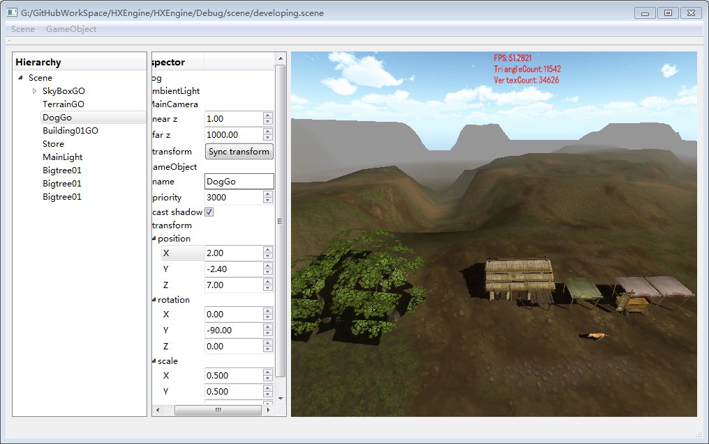
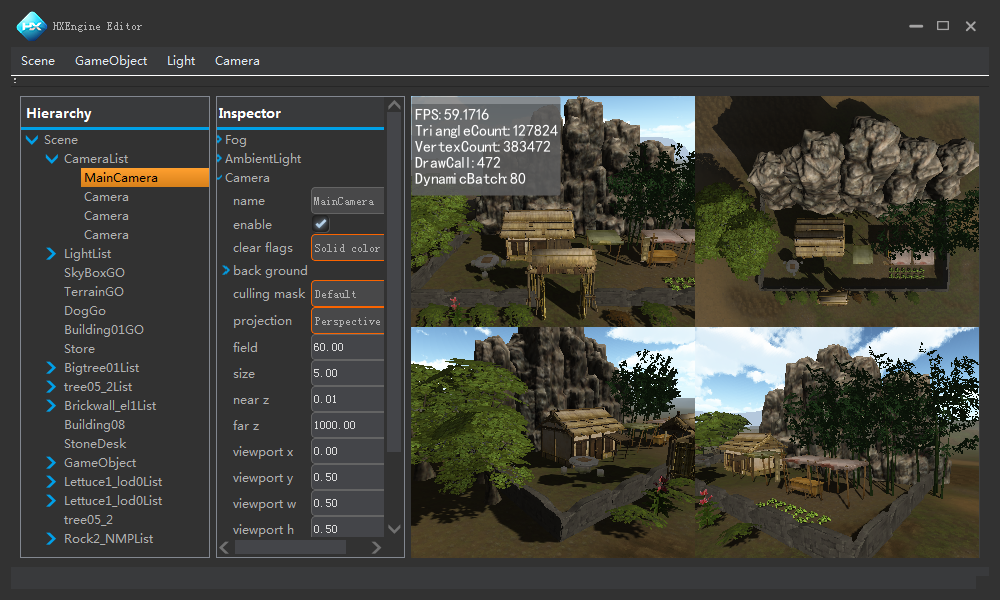
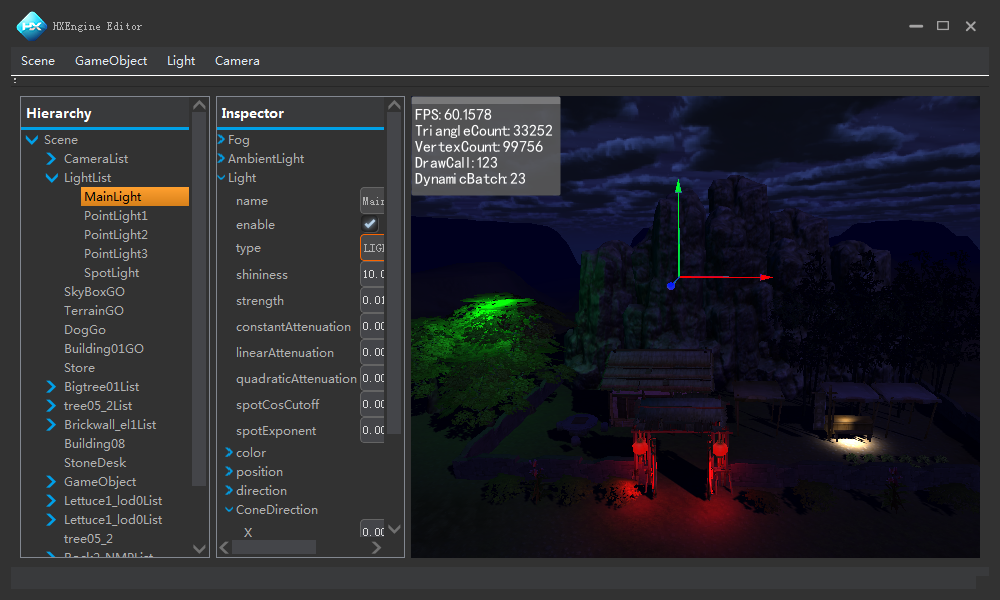

引擎框架UML图:
================================================================================
  

Editor视图:
================================================================================
  
  
  

Game视图:
================================================================================
  

Configuration
================================================================================
visual studio 2015  x86 debug 环境下运行  
libfbxsdk-md.lib[自行下载](https://pan.baidu.com/s/1oCiEz5Ol3jDkzU6Ut0FoQg)放入HXCore\fbx\lib\vs2015\x86\debug目录下（超过100M Github不让上传）

所使用的库包括: freeglut、glew、freetype、libpng、zlib、tinyxml、fbx、qt

QT SceneEditor:
================================================================================
支持场景加载、场景序列化保存、加载prefab创建gameobject、删除gameobject、雾编辑、环境光编辑、相机编辑、gameobject编辑、light编辑等

OpenGL RenderSystem:
================================================================================
FBX模型加载、骨骼动画、数学库、UI字体、DDS/PNG加载、相机系统、光照、材质、阴影、SKYBOX、FOG、场景可配置化、场景编辑器、MultiCamera、可渲染单位排序、动态批处理  
GLSL：实现了MultiLight、Fog、CubeMapping、ShadowMap、NormalMap、DetailMap、PBS、IBL等  
使用右手坐标系  
列主序向量 列主序矩阵  

TODO:
八叉树场景管理、OIT、HDR、deferred lighting、lighting map、GI等

GDI RenderSystem:
================================================================================
游戏窗口创建及循环 GDI 数学库 相机 固定流水线 模型加载 骨骼动画 BMP加载  
使用左手坐标系     由 UVN N方向决定   背面裁剪三角形缠绕方向及法线方向  
行主序向量 行主序矩阵	最后渲染X轴反转以保持与OPENGL方向一致  
世界空间背面消除

TODO:  
* cpu:  
    > 世界空间gameobject:  
        >> 四叉树、八叉树、BSP、PVS、PORTAL(不需要每帧更新变化，游戏开始时固定生成的数据结构)  
        >> Frustum culling    CullSphere(只需把中心点转换到视图空间进行判断)  
    > renderlist:  
        >> cull back  
* gpu:  
    > 投影齐次裁剪空间renderlist:  
        >> Frustum culling  
        >> Frustum cliping-->填充平底和平顶三角形时，丢弃屏幕外像素
		

D3D RenderSystem:
================================================================================

Vulkan RenderSystem:
================================================================================

Matel RenderSystem:
================================================================================
