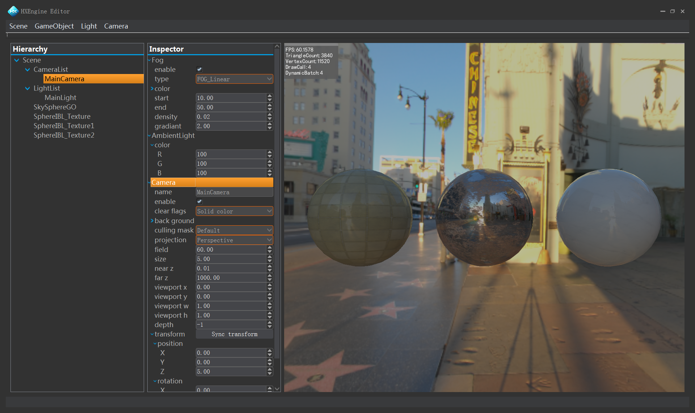
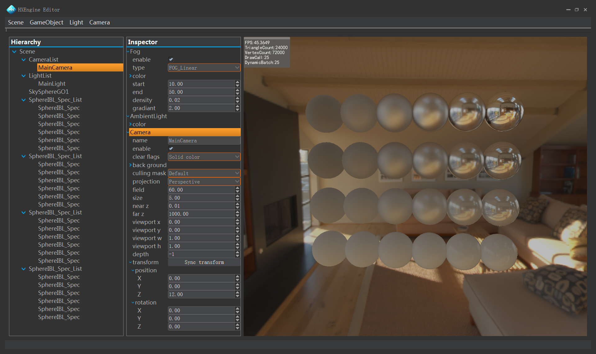
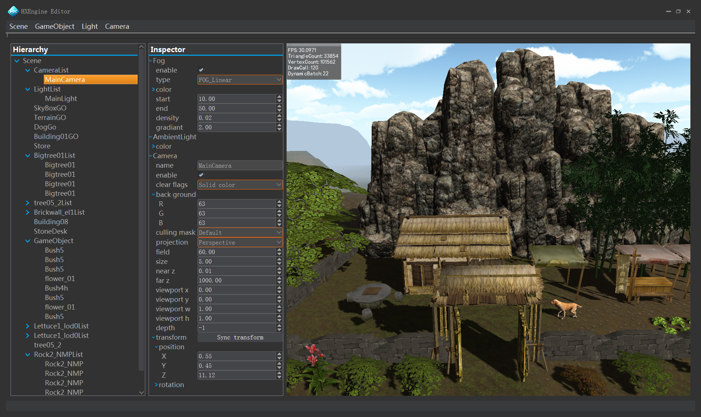
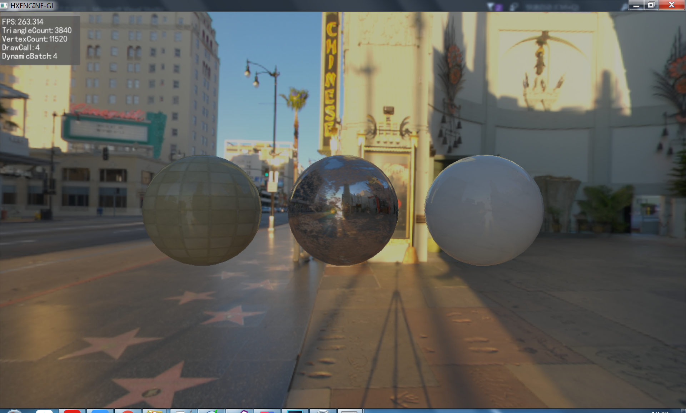

# HXEngine  
a cross-platform open source game engine developed by personal   

# Features  
  1. Crossplatform architecture, easy-to-add support for more platforms. The supported platforms are:  
      * Windows (x64/x86)  
      * MacOs  

  2. Plugin-based framework, maximum decoupling and flexible customization:  
      * HXCore
          * GDI
          * OpenGL
          * D3D
      * HXEditor
      * HXGame

  3. Multiple rendering API support:  
      * GDI  
      * OpenGL  
      * D3D is planned  
      * Vulkan is planned  
      * Matel is planned  

  4. Core features:  
      * FBX importer  
      * Skeleton animation  
      * Math library  
      * UI font  
      * DDS/PNG/BMP importer  
      * MultiCamera system  
      * Material system  
      * MultiLighting & Shadow maps  
      * Skybox  
      * Linear/Exp/Expx fog  
      * Serialization scene  
      * Dynamic batch  
      * Support NormalMap/DetailMap/HDRI  
      * Image-based lighting  
      * Physically-based rendering  

  5. Editor:  
      * Scene load/serialize  
      * Prefab load/serialize  
      * Gameobject/Fog/Light/Camera editing  
 
# Configuration  
  1. You can run at visual studio 2015  x86 debug by opening `HXEngine.sln` directly.  
  2. Third-party libraries:  
      * freeglut  
      * glew  
      * freetype  
      * libpng  
      * zlib  
      * tinyxml  
      * fbx  
      * qt  

# Architecture UML  
  

# Editor view  
  
  
  
  
  

# Game view  
  

# Detailed documentation  
[https://huangx916.github.io/](https://huangx916.github.io/)  

